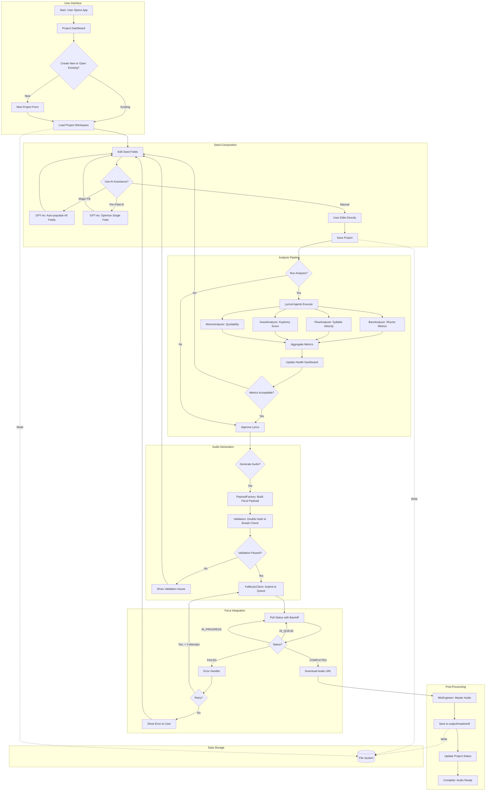
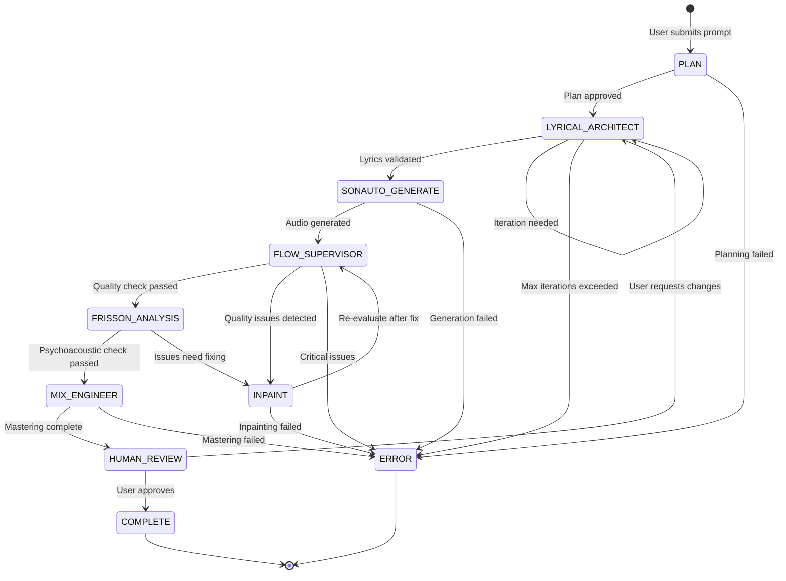
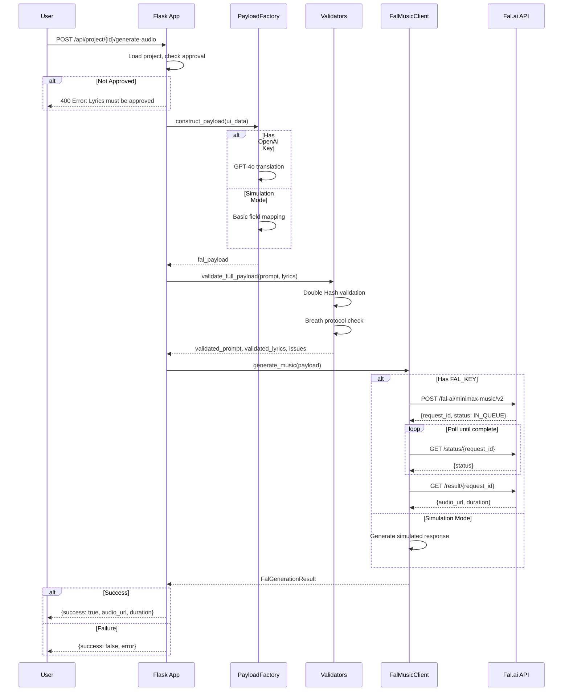
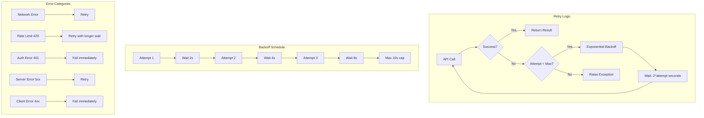

# APEX Engine - Data Flow

## Step 1: Quick Start

### Installation

```bash
# Clone the repository
git clone https://github.com/mackenziekarkheck-hash/Apex-Music-Engine.git
cd Apex-Music-Engine

# Create virtual environment (optional but recommended for local dev)
python -m venv venv
source venv/bin/activate  # Linux/macOS
# or: venv\Scripts\activate  # Windows

# Install dependencies
pip install -r requirements.txt

# Additional system requirements (if not on Replit)
# Debian/Ubuntu: apt-get install ffmpeg libsndfile1
# macOS: brew install ffmpeg libsndfile
```

### Running the Application

**Web UI (Recommended):**
```bash
cd apex_engine && python -m web.app
# Access at: http://localhost:5000
```

**CLI Mode:**
```bash
cd apex_engine && python main.py --cli
```

**Demo Mode (Simulation):**
```bash
cd apex_engine && python main.py --demo
```

**Using Startup Scripts:**
```bash
# Linux/macOS
./run.sh

# Windows
run.bat

# With options
./run.sh --cli
./run.sh --demo
./run.sh --help
```

---

## Step 2: Environment Variable Cheat Sheet

| Variable Name | Default Value | Purpose | Required |
|--------------|---------------|---------|----------|
| `FAL_KEY` | `None` | Fal.ai API key for MiniMax Music v2 audio generation | Yes (for real generation) |
| `OPENAI_API_KEY` | `None` | OpenAI API key for GPT-4o (lyrics, optimization, Magic Fill) | Yes (for AI features) |
| `AI_INTEGRATIONS_OPENAI_API_KEY` | `None` | Replit AI integration OpenAI key (preferred over OPENAI_API_KEY) | Optional |
| `AI_INTEGRATIONS_OPENAI_BASE_URL` | `None` | Replit AI integration base URL | Optional |
| `SONAUTO_API_KEY` | `None` | Sonauto API key (legacy, for direct Sonauto API access) | Optional |
| `SECRET_KEY` | `'apex-dev-key-change-in-prod'` | Flask session secret key | Yes (change in production!) |

### Environment Variable Resolution Order

**For OpenAI:**
1. `AI_INTEGRATIONS_OPENAI_API_KEY` (Replit integration - preferred)
2. `OPENAI_API_KEY` (direct key)
3. Falls back to simulation mode if neither set

**For Audio Generation:**
1. `FAL_KEY` (Fal.ai - current implementation)
2. Falls back to simulation mode if not set

### Setting Environment Variables

**Replit:**
1. Open the Secrets panel (Tools → Secrets)
2. Add key-value pairs

**Local Development:**
```bash
# Create .env file
cp .env.example .env

# Edit with your keys
FAL_KEY=your_fal_ai_key
OPENAI_API_KEY=your_openai_key
SECRET_KEY=your_secure_random_string
```

---

## Step 3: Input/Output Schemas

### Input Files

#### Project Configuration (`config.json`)

**Location:** `apex_engine/projects/<project_id>/config.json`

**Raw Example:**
```json
{
  "id": "2025-12-12_004807_test-project",
  "name": "Test Project",
  "created_at": "2025-12-12T00:48:07.123456",
  "updated_at": "2025-12-12T01:30:22.654321",
  "genre": "trap",
  "bpm": 140,
  "tags": ["trap", "hip hop", "rap", "dark", "aggressive"],
  "mood": "aggressive",
  "prompt_strength": 2.0,
  "balance_strength": 0.7,
  "current_iteration": 2,
  "status": "approved",
  "approved_version": 2,
  "prompt_text": "Dark trap with heavy 808s, ominous piano, and aggressive delivery",
  "lyrics_text": "[Verse]\nLines in the night, shadows creep\nBass so heavy it don't let you sleep\n\n[Chorus]\nWe rise up, never fall down\nKing of the city, wear the crown",
  "neuro_effects": "Frisson on chorus drop, tension build in verse",
  "neurochemical_effects": "Dopamine hooks, adrenaline verses",
  "musical_effects": "Heavy bass, reverb vocals, ## Drop ## after chorus",
  "state": {
    "approval": {
      "lyrics": {
        "approved": true,
        "timestamp": "2025-12-12T01:30:22.654321"
      }
    }
  }
}
```

#### Seed Text (`seed.txt`)

**Location:** `apex_engine/projects/<project_id>/seed.txt`

**Raw Example:**
```
Dark trap banger about rising from nothing.
Theme: underdog story, street success
Vibe: aggressive but triumphant
Key lines to include: "started from the bottom", "crown on my head"
```

#### Approved Lyrics (`approved/final_lyrics.txt`)

**Location:** `apex_engine/projects/<project_id>/approved/final_lyrics.txt`

**Raw Example:**
```
[Verse 1]
Started from the bottom, now I'm here
Every doubt I had, disappeared
Grind so hard, they thought I was insane
Now they watch me shine through the pain

[Pre-Chorus]
Can't nobody stop this momentum
When you at the top, they resent 'em

[Chorus]
Crown on my head, yeah I earned it
Every lesson learned, I discerned it
Rise up, never fall down
King of this city, hold it down

[Verse 2]
//
Late nights, early mornings, no sleep
Stacking wins while they counting sheep
//
Every setback was a setup
For the comeback that would never let up

[Bridge]
## Instrumental Break ##

[Outro]
Remember where you came from
But never forget where you're going
```

#### API Payload (`approved/api_payload.json`)

**Location:** `apex_engine/projects/<project_id>/approved/api_payload.json`

**Raw Example (Fal.ai format):**
```json
{
  "input": {
    "prompt": "Dark trap, heavy 808s, ominous piano, aggressive delivery, soaring dynamics, catchy hooks",
    "lyrics_prompt": "[Verse 1]\nStarted from the bottom, now I'm here\nEvery doubt I had, disappeared\n\n[Chorus]\nCrown on my head, yeah I earned it\n\n## Drop ##\n\n[Verse 2]\nLate nights, early mornings, no sleep",
    "song_duration": 120
  }
}
```

### Output Files

| Output | Location | Mode | Description |
|--------|----------|------|-------------|
| Generated Audio | `apex_engine/output/*.wav` | Overwrite | Raw audio from Fal.ai/Sonauto |
| Mastered Audio | `apex_engine/output/mastered/*_mastered.wav` | Overwrite | Post-mastering output |
| Iteration Lyrics | `apex_engine/projects/<id>/iterations/v<n>_lyrics.txt` | Append (new file per version) | Version history of lyrics |
| Project Config | `apex_engine/projects/<id>/config.json` | Overwrite | Project metadata (updated on save) |
| Approved Seed | `apex_engine/projects/<id>/approved/seed_composition.json` | Overwrite | Final approved seed data |

### Simulated Output Files

When running without API keys, the system generates simulated files:

```
apex_engine/output/
├── simulated_sim_1765490310_8518.ogg       # Simulated audio
├── simulated_sim_1765490311_4633.ogg
└── mastered/
    ├── simulated_sim_1765490310_8518.ogg_mastered.wav
    └── simulated_sim_1765490311_4633.ogg_mastered.wav
```

---

## Step 4: Mermaid Flowchart (Logic & State)

### Main Application Flow



### Orchestrator State Machine



### API Request Flow



### Error Handling & Retry Logic


